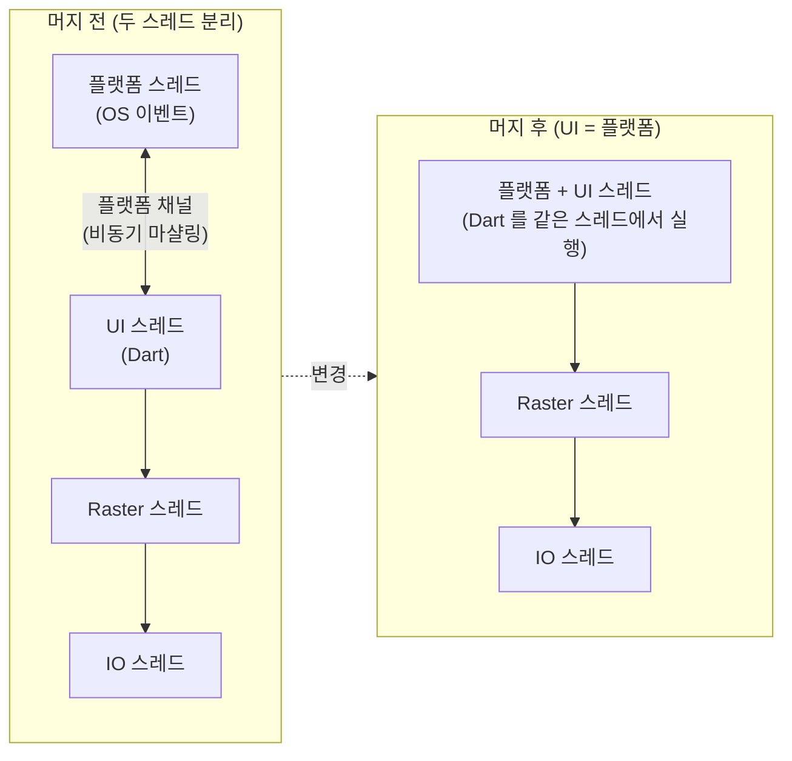
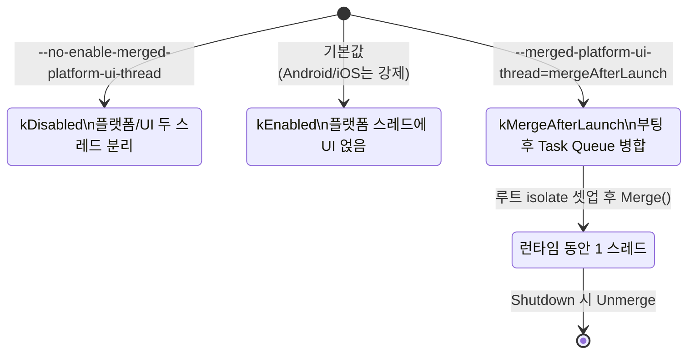
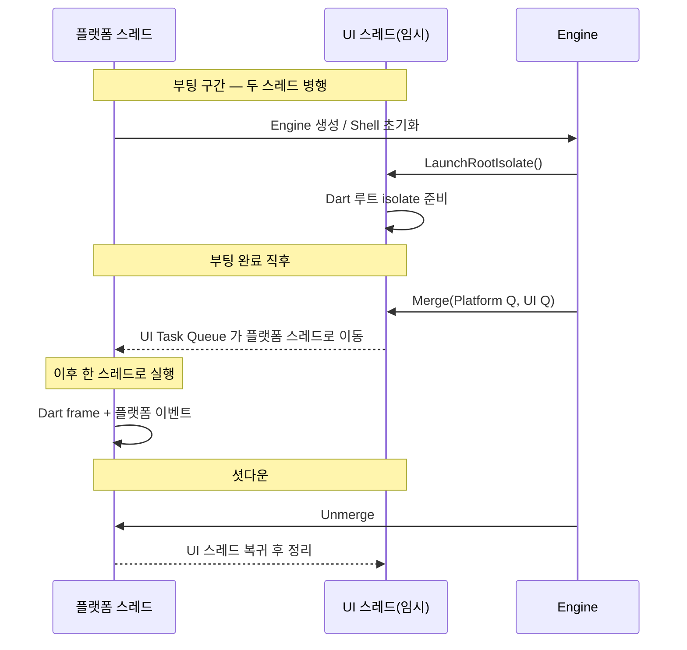
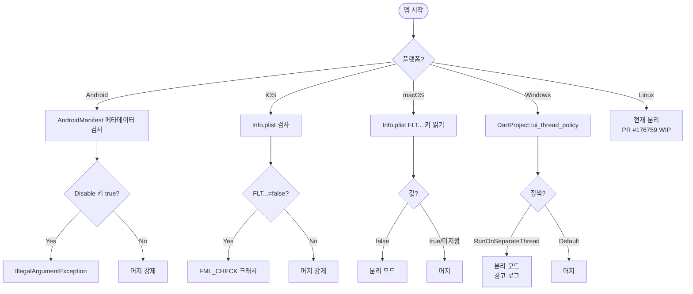

## 저자 노트

이 글의 바탕이 된 분석은 Dalinaum 이 이전에 gist 에 초벌글로 올려둔 상태였다. 블로그 포스트만큼 정리되지 않은, 코드 읽기 메모에 가까운 원고다.

1편은 2025-11-26, 2편은 2025-12-23 에 올려놓고 각각 약 137일, 약 110일 동안 방치해 뒀다. 오늘(2026-04-12) 에야 Claude 로 문장을 다듬고 구조를 정리해 하나로 합쳤다. 인공지능을 끌어다 쓴 건 사실상 *Dalinaum 의 게으름 때문이다* — 진작 끝낸 분석을 글로 쓰지 않고 묵혀둔 초벌글을 LLM 으로 밀어낸 셈이다.

요즘은 AI 가 초안을 쓰고 사람이 다듬는 흐름이 기본이지만, 이 글은 반대다. AI 대신 HI(Human Intelligence) 가 본문을 썼고 AI 는 교열·편집만 맡은 구조 — 라고 포장하면 그럴듯하고, 솔직히는 HI 가 게을러서 마지막 한 발짝을 AI 에게 떠넘긴 거다. 해석과 판단의 책임은 HI 에게, 편집 책임은 AI 에게 있다.

두 편의 초벌 글을 하나로 합치고, Android 일변도로 치우쳐 있던 설명을 iOS / macOS / Windows 까지 확장했다. 초벌 글 이후 추가된 변경(특히 **Android / iOS opt-out 의 완전 제거**)과 현재 구조(3-state enum `MergedPlatformUIThread`) 도 반영했다.

- 초벌 글 1 (엔진 중심, 안드로이드): https://gist.github.com/dalinaum/8929555596d3e66b505b1f54f0497958
- 초벌 글 2 (이슈 요약, iOS 사례): https://gist.github.com/dalinaum/c7660e330ae71353eed3f390666cad23

**기준 리비전:** Flutter 3.38.5 stable (`origin/stable`, 커밋 `f6ff1529fd6`).
아래 코드 인용의 파일 경로와 라인 번호는 모두 이 리비전 기준이다.

---

## 1. 들어가며 — 저장소 이동 안내

Flutter 엔진 코드는 예전엔 [flutter/engine](https://github.com/flutter/engine) 라는 **별도 저장소** 에 있었지만, 현재는 메인 저장소 [flutter/flutter](https://github.com/flutter/flutter) 로 통합되어 [`engine/`](https://github.com/flutter/flutter/tree/master/engine) 서브트리에 들어가 있다.

그래서 과거에 경로를 `shell/platform/android/android_shell_holder.cc` 식으로 썼다면, 지금은 다음처럼 바뀐다.

```
# 과거 (flutter/engine 단독 저장소)
shell/platform/android/android_shell_holder.cc

# 현재 (flutter/flutter 모노레포)
engine/src/flutter/shell/platform/android/android_shell_holder.cc
```

이 글에서는 모노레포 경로 기준으로만 인용한다.

---

## 2. 왜 스레드를 합치려 하는가 — #150525 요약

메인 이슈: [flutter/flutter#150525](https://github.com/flutter/flutter/issues/150525)

### 이전 모델 요약

Flutter 는 전통적으로 **플랫폼 스레드** 와 **UI 스레드(Dart 실행)** 를 분리해서 썼다. UI 스레드가 무거워도 플랫폼 스레드는 계속 OS 이벤트를 받을 수 있도록 하는 것이 명분이었지만, 대부분의 앱에서 플랫폼 스레드는 거의 놀고 있었고, UI 스레드가 프레임을 못 맞추면 결국 똑같이 버벅인다. 얻는 게 크지 않았다는 뜻이다.



반대로 단점은 분명했다.

- **Dart → 플랫폼 호출이 동기가 아님.** 네이티브 API는 플랫폼 스레드에서 호출해야 하므로, Dart 에서 FFI 로 직접 부를 수 없고 플랫폼 채널로 마샬링 해야 했다. 간단한 동기 호출이 비동기화 되면서 보일러플레이트와 지연이 붙는다.
- **플랫폼 → Dart 콜백이 동기 응답을 요구.** 접근성 질의, 키보드 이벤트, IME, `NSApplicationDelegate`, 드래그 가능 영역 같은 많은 콜백이 "이 호출 스택 안에서 답해라" 라고 요구한다. 두 스레드가 분리돼 있으면 여기에 동기 응답을 하려면 상태를 미리 플랫폼 스레드로 흘려두는 **결과적 일관성(eventual consistency)** 전략을 써야 하는데, 이게 자주 깨진다.

### 기존에 쓰던 두 가지 우회

1. **iOS 키보드: 중첩 CFRunLoop**
   `handlePress:` 안에서 Dart 로 메시지를 보낸 뒤, 응답이 올 때까지 **현재 스레드에서 CFRunLoop 을 중첩으로 돌린다.** 결과가 도착하면 중첩 RunLoop 을 Stop 해 원래 UIKit 콜 스택으로 복귀.

   `engine/src/flutter/shell/platform/darwin/ios/framework/Source/FlutterKeyboardManager.mm:53-109`

   ```objc
   - (void)handlePress:(nonnull FlutterUIPressProxy*)press
            nextAction:(nonnull void (^)())next API_AVAILABLE(ios(13.4)) {
     ...
     bool __block wasHandled = false;
     KeyEventCompleteCallback completeCallback = ^void(bool handled, FlutterUIPressProxy* press) {
       wasHandled = handled;
       CFRunLoopStop(CFRunLoopGetCurrent());
     };
     switch (press.phase) {
       case UIPressPhaseBegan:
       case UIPressPhaseEnded: {
         ...
         for (id<FlutterKeyPrimaryResponder> responder in _primaryResponders) {
           [responder handlePress:press callback:replyCallback];
         }
         // Create a nested run loop while we wait for a response from the
         // framework. Once the completeCallback is called, this run loop will exit
         // and the main one will resume. The completeCallback MUST be called, or
         // the app will get stuck in this run loop indefinitely.
         //
         // We need to run in this mode so that UIKit doesn't give us new
         // events until we are done processing this one.
         CFRunLoopRunInMode(fml::MessageLoopDarwin::kMessageLoopCFRunLoopMode, kDistantFuture, NO);
         break;
       }
       ...
     }
     if (!wasHandled) {
       next();
     }
   }
   ```

   (부연) 과거에는 이 코드가 `FlutterTextInputPlugin.mm` 에 있었는데, 3.38.5 시점에는 **`FlutterKeyboardManager.mm` 으로 이관** 되어 있다. 동작 원리는 동일.

   재진입 위험이 명백하다. 중첩 RunLoop 이 돌아가는 동안 UIKit 가 다른 이벤트를 태울 수 있고, Dart isolate 가 그 와중에 종료되면 어떻게 탈출할지도 이슈가 된다.

2. **Android IME: 편집 상태를 미리 캐시**
   `InputMethodManager` 가 플랫폼 스레드에서 동기적으로 텍스트를 요구해도 곧바로 Dart 쪽 편집 상태를 못 부르니, 최신 편집 상태를 **자바 측에 미리 복제** 해두고 그걸 반환한다.

   `engine/src/flutter/shell/platform/android/io/flutter/plugin/editing/InputConnectionAdaptor.java:220-235`

   ```java
   // When there's not enough vertical screen space, the IME may enter fullscreen mode and this
   // method will be used to get (a portion of) the currently edited text. Samsung keyboard seems
   // to use this method instead of InputConnection#getText{Before,After}Cursor.
   // See https://github.com/flutter/engine/pull/17426.
   // TODO(garyq): Implement a more feature complete version of getExtractedText
   @Override
   public ExtractedText getExtractedText(ExtractedTextRequest request, int flags) {
     final boolean textMonitor = (flags & GET_EXTRACTED_TEXT_MONITOR) != 0;
     if (textMonitor == (mExtractRequest == null)) {
       Log.d(TAG, "The input method toggled text monitoring " + (textMonitor ? "on" : "off"));
     }
     // Enables text monitoring if the relevant flag is set. See
     // InputConnectionAdaptor#didChangeEditingState.
     mExtractRequest = textMonitor ? request : null;
     return getExtractedText(request);
   }
   ```

   내부적으로는 `mEditable` 이라는 복제 버퍼에서 셀렉션/텍스트를 읽어 돌려준다. iOS IME 가 "이벤트 시퀀스를 빠르게 쏘고 바로 텍스트를 읽어" 상태 불일치를 일으키는 문제와 **동일한 뿌리** 의 이슈다.

### 머지로 얻는 것

- Dart 에서 FFI 로 플랫폼 API 를 **동기 직접 호출** 가능.
- 접근성 / 키보드 이벤트 / 드래그 앤 드롭 / IME 커서 질의 / `NSApplicationDelegate` / 윈도우 드래그 영역 같은 **동기 콜백에 Dart 가 바로 답할 수 있음**. 복제·캐싱·중첩 RunLoop 같은 꼼수를 걷어낼 수 있음.
- 플랫폼 채널 자체는 여전히 비동기로 남길 수 있어서 **기존 플러그인 대부분은 그대로 동작**.

### 단점과 리스크

- 생태계 전반에 영향을 주는 바탕 변경. 일부 플러그인이 플랫폼 스레드 가정을 깨고 부정확하게 동작할 가능성.
- 특히 Linux 는 역사적으로 플랫폼/래스터 를 공유하는 경향이 있어 래스터 성능 리스크가 있고, 별도의 래스터 스레드 도입을 동반해야 한다는 의견이 있음.

### 로드맵 (3.38 시점 현재 상태)

| 플랫폼 | 머지 기본화 | opt-out |
|---|---|---|
| iOS | 3.29 부터 기본 | **3.38 에서 제거됨** |
| Android | 3.29 부터 기본 | **3.38 에서 제거됨** |
| macOS | 3.35 부터 기본 | 아직 가능 |
| Windows | 3.35 부터 기본 | 아직 가능 |
| Linux | WIP (PR #176759) | — |

---

## 3. 엔진 구현 — 어떻게 합쳐지는가

### 3.1 설정 플래그 — `merged_platform_ui_thread`

과거에는 이게 단순한 `bool` 이었지만, **지금은 3-state enum** 이다.

`engine/src/flutter/common/settings.h:367-380`

```cpp
enum class MergedPlatformUIThread {
  // Use separate threads for the UI and platform task runners.
  kDisabled,
  // Use the platform thread for both the UI and platform task runners.
  kEnabled,
  // Start the engine on a separate UI thread and then move the UI task
  // runner to the platform thread after the engine is initialized.
  // This can improve app launch latency by allowing other work to run on
  // the platform thread during engine startup.
  kMergeAfterLaunch
};

MergedPlatformUIThread merged_platform_ui_thread =
    MergedPlatformUIThread::kEnabled;
```

- `kDisabled` : 옛날처럼 두 스레드가 분리.
- `kEnabled` : 플랫폼 스레드 위에 UI Task Runner 를 그대로 얹어서 **한 스레드**로 돌림. 현재 기본값.
- `kMergeAfterLaunch` : **엔진 부팅 중에는 별도 UI 스레드로 시작**하고, 루트 isolate 셋업이 끝난 뒤에 UI Task Queue 를 플랫폼 Task Queue 에 병합해 그 뒤부터는 같은 스레드에서 실행. 앱 시작 시점의 플랫폼 스레드 부담을 덜기 위한 옵션.



### 3.2 CLI 스위치

`engine/src/flutter/shell/common/switch_defs.h:279-286`

```cpp
DEF_SWITCH(MergedPlatformUIThread,
           "merged-platform-ui-thread",
           "Sets whether the ui thread and platform thread should be merged.")
// This is a legacy flag that has been superseded by merged-platform-ui-thread.
// TODO(163064): remove this when users have been migrated.
DEF_SWITCH(DisableMergedPlatformUIThread,
           "no-enable-merged-platform-ui-thread",
           "Disables merging of the UI and platform threads.")
```

- 새 스위치 : `--merged-platform-ui-thread=<enabled|disabled|mergeAfterLaunch>`
- 레거시 스위치 : `--no-enable-merged-platform-ui-thread` (사라질 예정)

파싱부. 플랫폼 측에서 "머지가 필수" 라고 선언한 경우에는 `FML_CHECK` 으로 분리 요청을 거부한다.

`engine/src/flutter/shell/common/switches.cc:520-551`

```cpp
constexpr std::string_view kMergedThreadEnabled = "enabled";
constexpr std::string_view kMergedThreadDisabled = "disabled";
constexpr std::string_view kMergedThreadMergeAfterLaunch = "mergeAfterLaunch";
if (command_line.HasOption(
        FlagForSwitch(Switch::DisableMergedPlatformUIThread))) {
  FML_CHECK(!require_merged_platform_ui_thread)
      << "This platform does not support the "
      << FlagForSwitch(Switch::DisableMergedPlatformUIThread) << " flag";

  settings.merged_platform_ui_thread =
      Settings::MergedPlatformUIThread::kDisabled;
} else if (command_line.HasOption(
               FlagForSwitch(Switch::MergedPlatformUIThread))) {
  std::string merged_platform_ui;
  command_line.GetOptionValue(FlagForSwitch(Switch::MergedPlatformUIThread),
                              &merged_platform_ui);
  if (merged_platform_ui == kMergedThreadEnabled) {
    settings.merged_platform_ui_thread =
        Settings::MergedPlatformUIThread::kEnabled;
  } else if (merged_platform_ui == kMergedThreadDisabled) {
    FML_CHECK(!require_merged_platform_ui_thread)
        << "This platform does not support the "
        << FlagForSwitch(Switch::MergedPlatformUIThread) << "="
        << kMergedThreadDisabled << " flag";

    settings.merged_platform_ui_thread =
        Settings::MergedPlatformUIThread::kDisabled;
  } else if (merged_platform_ui == kMergedThreadMergeAfterLaunch) {
    settings.merged_platform_ui_thread =
        Settings::MergedPlatformUIThread::kMergeAfterLaunch;
  }
}
```

### 3.3 스레드 생성 — OS 스레드는 "필요할 때만" 만든다

머지의 핵심 아이디어는 **"UI 스레드를 아예 안 만든다"** 이다. `ThreadHost` 는 bit mask 로 어떤 OS 스레드를 만들지 선택하는데, 머지 모드에서는 마스크에서 `kUi` 를 빼버린다.

`engine/src/flutter/shell/platform/android/android_shell_holder.cc:90-149`

```cpp
auto mask = ThreadHost::Type::kRaster | ThreadHost::Type::kIo;
if (settings.merged_platform_ui_thread !=
    Settings::MergedPlatformUIThread::kEnabled) {
  mask |= ThreadHost::Type::kUi;
}

flutter::ThreadHost::ThreadHostConfig host_config(
    thread_label, mask, AndroidPlatformThreadConfigSetter);
// ... ui/raster/io config ...

thread_host_ = std::make_shared<ThreadHost>(host_config);

// ...

fml::RefPtr<fml::TaskRunner> raster_runner;
fml::RefPtr<fml::TaskRunner> ui_runner;
fml::RefPtr<fml::TaskRunner> io_runner;
fml::RefPtr<fml::TaskRunner> platform_runner =
    fml::MessageLoop::GetCurrent().GetTaskRunner();
raster_runner = thread_host_->raster_thread->GetTaskRunner();
if (settings.merged_platform_ui_thread ==
    Settings::MergedPlatformUIThread::kEnabled) {
  ui_runner = platform_runner;
} else {
  ui_runner = thread_host_->ui_thread->GetTaskRunner();
}
io_runner = thread_host_->io_thread->GetTaskRunner();
```

핵심은 두 문장이다.

- `mask` 에서 `kUi` 를 제외 → UI 용 OS 스레드를 아예 pthread_create 하지 않음.
- `ui_runner = platform_runner` → 플랫폼 스레드에 이미 붙어 있는 MessageLoop 의 TaskRunner 를 UI Task Runner 로도 사용. 한 스레드의 한 MessageLoop 에 Dart 태스크와 플랫폼 이벤트가 모두 흐름.

`fml::MessageLoop` 은 **스레드 로컬 싱글톤** 이다.

`engine/src/flutter/fml/message_loop.cc`

```cpp
static thread_local std::unique_ptr<MessageLoop> tls_message_loop;

void MessageLoop::EnsureInitializedForCurrentThread() {
  if (tls_message_loop.get() != nullptr) {
    // Already initialized.
    return;
  }
  tls_message_loop.reset(new MessageLoop());
}
```

즉 "플랫폼 스레드 위에서 `EnsureInitializedForCurrentThread()` 를 부른다" → 플랫폼 스레드가 MessageLoop 을 하나 갖게 된다 → 그 TaskRunner 를 UI 도 재사용 → "UI 스레드" 라는 개념이 그냥 그 MessageLoop 에 포스트되는 태스크 집합이 됨, 이라는 구조다.

### 3.4 iOS 측 스레드 구성

`engine/src/flutter/shell/platform/darwin/ios/framework/Source/FlutterEngine.mm:806-905` 에서 Android 와 거의 똑같은 논리를 탄다.

```objc
static flutter::ThreadHost MakeThreadHost(NSString* thread_label,
                                          const flutter::Settings& settings) {
  // The current thread will be used as the platform thread. Ensure that the message loop is
  fml::MessageLoop::EnsureInitializedForCurrentThread();

  uint32_t threadHostType = flutter::ThreadHost::Type::kRaster | flutter::ThreadHost::Type::kIo;
  if (settings.merged_platform_ui_thread != flutter::Settings::MergedPlatformUIThread::kEnabled) {
    threadHostType |= flutter::ThreadHost::Type::kUi;
  }
  ...
}
```

이후 Task Runner 연결부. Impeller 가 활성이고 머지 모드일 때 현재 MessageLoop 의 TaskRunner 를 UI Runner 로 쓴다.

```objc
fml::RefPtr<fml::TaskRunner> ui_runner;
if (settings.enable_impeller &&
    settings.merged_platform_ui_thread == flutter::Settings::MergedPlatformUIThread::kEnabled) {
  ui_runner = fml::MessageLoop::GetCurrent().GetTaskRunner();
} else {
  ui_runner = _threadHost->ui_thread->GetTaskRunner();
}
```

### 3.5 macOS 측 — Embedder API 경로

macOS 는 다른 데스크탑 임베더들처럼 **엔진 임베더 API(`FlutterCustomTaskRunners`)** 로 Task Runner 를 꽂아 준다. `ui_task_runner` 에 플랫폼 Task Runner 와 동일한 설명자를 넣으면 머지가 된다.

`engine/src/flutter/shell/platform/darwin/macos/framework/Source/FlutterEngine.mm:727-754`

```objc
BOOL mergedPlatformUIThread = YES;
NSNumber* enableMergedPlatformUIThread =
    [[NSBundle mainBundle] objectForInfoDictionaryKey:@"FLTEnableMergedPlatformUIThread"];
if (enableMergedPlatformUIThread != nil) {
  mergedPlatformUIThread = enableMergedPlatformUIThread.boolValue;
}

if (mergedPlatformUIThread) {
  NSLog(@"Running with merged UI and platform thread. Experimental.");
}

// The task description needs to be created separately for platform task
// runner and UI task runner because each one has their own __bridge_retained
// engine user data.
FlutterTaskRunnerDescription platformTaskRunnerDescription =
    [self createPlatformThreadTaskDescription];
std::optional<FlutterTaskRunnerDescription> uiTaskRunnerDescription;
if (mergedPlatformUIThread) {
  uiTaskRunnerDescription = [self createPlatformThreadTaskDescription];
}

const FlutterCustomTaskRunners custom_task_runners = {
    .struct_size = sizeof(FlutterCustomTaskRunners),
    .platform_task_runner = &platformTaskRunnerDescription,
    .thread_priority_setter = SetThreadPriority,
    .ui_task_runner = uiTaskRunnerDescription ? &uiTaskRunnerDescription.value() : nullptr,
};
flutterArguments.custom_task_runners = &custom_task_runners;
```

### 3.6 Windows 측 — `FlutterUIThreadPolicy`

Windows 는 Info.plist 를 쓸 수 없으니 **임베더 API 레벨에서 정책을 받는다.**

`engine/src/flutter/shell/platform/windows/flutter_windows_engine.cc:315-331`

```cpp
FlutterCustomTaskRunners custom_task_runners = {};
custom_task_runners.struct_size = sizeof(FlutterCustomTaskRunners);
custom_task_runners.platform_task_runner = &platform_task_runner;
custom_task_runners.thread_priority_setter =
    &WindowsPlatformThreadPrioritySetter;

if (project_->ui_thread_policy() !=
    FlutterUIThreadPolicy::RunOnSeparateThread) {
  custom_task_runners.ui_task_runner = &platform_task_runner;
} else {
  FML_LOG(WARNING) << "Running with unmerged platform and UI threads. This "
                      "will be removed in future.";
}
```

`FlutterUIThreadPolicy::RunOnSeparateThread` 가 아니면 UI Task Runner 를 플랫폼과 동일한 것으로 꽂고, 분리 요청 시에는 경고 로그를 남긴다. 이 옵션도 릴리즈를 거치며 제거될 계획.

### 3.7 `kMergeAfterLaunch` — 부팅 지연을 줄이려는 하이브리드

루트 isolate 가 부팅되는 동안은 별도 UI 스레드가 Dart 코드를 돌리다가, 부팅이 끝나면 UI Task Queue 를 플랫폼 Task Queue 에 병합해 그 뒤부터는 한 스레드에서 처리한다.

`engine/src/flutter/shell/common/engine.cc:247-291`

```cpp
if (settings_.merged_platform_ui_thread ==
    Settings::MergedPlatformUIThread::kMergeAfterLaunch) {
  // Queue a task to the UI task runner that sets the owner of the root
  // isolate.  This task runs after the thread merge and will therefore be
  // executed on the platform thread.  The task will run before any tasks
  // queued by LaunchRootIsolate that execute the app's Dart code.
  task_runners_.GetUITaskRunner()->PostTask([engine = GetWeakPtr()]() {
    if (engine) {
      engine->runtime_controller_->SetRootIsolateOwnerToCurrentThread();
    }
  });
}

// ... LaunchRootIsolate 호출 ...

if (settings_.merged_platform_ui_thread ==
    Settings::MergedPlatformUIThread::kMergeAfterLaunch) {
  // Move the UI task runner to the platform thread.
  bool success = fml::MessageLoopTaskQueues::GetInstance()->Merge(
      task_runners_.GetPlatformTaskRunner()->GetTaskQueueId(),
      task_runners_.GetUITaskRunner()->GetTaskQueueId());
  if (!success) {
    FML_LOG(ERROR)
        << "Unable to move the UI task runner to the platform thread";
  }
}
```

셧다운 때는 반대로 Unmerge 해서 UI 스레드를 원래 자리로 돌려놓은 뒤 정리한다(`engine/src/flutter/shell/common/shell.cc:665-677`). 또한 이 모드에서는 엔진 **spawn 이 금지** 된다 — 같은 Task Runner 를 공유하는 엔진을 여럿 띄우면 데드락이 나기 때문(`shell.cc:686-694`).



### 3.8 Dart 측면 — Isolate/스레드 라벨

Dart VM 에는 "내가 지금 머지 모드인가" 에 대응하는 소유권/이름 부여 로직이 들어간다.

`engine/src/flutter/runtime/dart_isolate.cc:155-161`

```cpp
tonic::DartState::Scope scope(isolate.get());
if (settings.merged_platform_ui_thread !=
    Settings::MergedPlatformUIThread::kMergeAfterLaunch) {
  Dart_SetCurrentThreadOwnsIsolate();
}
```

그리고 Observatory/DevTools 에서 보이는 스레드 라벨도 타임라인별로 UI/raster/io 를 구분한다.

`engine/src/flutter/runtime/dart_isolate.cc:629-648`

```cpp
if (auto task_runner = task_runners.GetRasterTaskRunner()) {
  task_runner->PostTask(
      [label = task_runners.GetLabel() + std::string{".raster"}]() {
        Dart_SetThreadName(label.c_str());
      });
}

if (auto task_runner = task_runners.GetUITaskRunner()) {
  task_runner->PostTask(
      [label = task_runners.GetLabel() + std::string{".ui"}]() {
        Dart_SetThreadName(label.c_str());
      });
}
```

UI Task Runner 가 플랫폼 스레드와 같은 스레드를 가리키면 결과적으로 같은 OS 스레드에 `.ui` 라벨이 붙게 된다(프로파일러에서 보면 플랫폼 스레드가 `.ui` 로 표시되는 경우가 이 때문).

### 3.9 Android JNI — 시작점

`engine/src/flutter/shell/platform/android/platform_view_android_jni_impl.cc:185-197`

```cpp
// Called By Java
static jlong AttachJNI(JNIEnv* env, jclass clazz, jobject flutterJNI) {
  fml::jni::JavaObjectWeakGlobalRef java_object(env, flutterJNI);
  std::shared_ptr<PlatformViewAndroidJNI> jni_facade =
      std::make_shared<PlatformViewAndroidJNIImpl>(java_object);
  auto shell_holder = std::make_unique<AndroidShellHolder>(
      FlutterMain::Get().GetSettings(), jni_facade,
      FlutterMain::Get().GetAndroidRenderingAPI());
  if (shell_holder->IsValid()) {
    return reinterpret_cast<jlong>(shell_holder.release());
  } else {
    return 0;
  }
}
```

자바 쪽 `FlutterJNI.nativeAttach` 가 이걸 호출하면서 3.3 의 `AndroidShellHolder` 생성자가 돌고, 그 안에서 `merged_platform_ui_thread` 설정에 따라 OS 스레드 구성이 달라진다.

---

## 4. 옵션 설정 — 플랫폼별 방법 ★

**3.38.5 시점에 각 플랫폼에서 실제로 어떻게 켜고 끌 수 있는지** 표로 먼저 정리한다.

| 플랫폼 | 기본 | opt-out 가능? | 설정 경로 |
|---|---|---|---|
| Android | merged | ✗ (3.38 에서 제거됨, 설정 시 예외) | — |
| iOS | merged | ✗ (3.38 에서 제거됨, `FML_CHECK`) | — |
| macOS | merged | ✓ | `Info.plist` 의 `FLTEnableMergedPlatformUIThread=false` |
| Windows | merged | ✓ | `DartProject::set_ui_thread_policy(RunOnSeparateThread)` |
| Linux | 분리 (WIP) | — | — |



### 4.1 Android — opt-out 은 사라졌다

예전에는 다음처럼 `AndroidManifest.xml` 에 메타데이터를 박으면 `FlutterLoader` 가 `--no-enable-merged-platform-ui-thread` 스위치를 엔진에 전달했다.

```xml
<!-- 예전 방식 — 이제는 동작하지 않음 -->
<meta-data
    android:name="io.flutter.embedding.android.DisableMergedPlatformUIThread"
    android:value="true" />
```

하지만 Flutter 3.38.5 기준에서는 이 키 자체가 여전히 존재하긴 해도 **예외를 던지도록** 바뀌었다.

`engine/src/flutter/shell/platform/android/io/flutter/embedding/engine/loader/FlutterLoader.java:53-54`

```java
private static final String DISABLE_MERGED_PLATFORM_UI_THREAD_KEY =
    "io.flutter.embedding.android.DisableMergedPlatformUIThread";
```

`engine/src/flutter/shell/platform/android/io/flutter/embedding/engine/loader/FlutterLoader.java:432-435`

```java
if (metaData.getBoolean(DISABLE_MERGED_PLATFORM_UI_THREAD_KEY, false)) {
  throw new IllegalArgumentException(
      DISABLE_MERGED_PLATFORM_UI_THREAD_KEY + " is no longer allowed.");
}
```

즉 Android 에서는 **사용자 코드에서 머지를 끄는 길이 완전히 막혔다.** 만약 이 키를 `true` 로 남겨두고 업그레이드했다면 앱이 시작하지 못하고 예외가 난다. 반드시 제거해야 한다.

(부연) `dev/devicelab/lib/tasks/perf_tests.dart` 에서 발견되는 `'io.flutter.embedding.android.EnableMergedPlatformUIThread'` 키는 **테스트 인프라 전용** 이다. 프로덕션 앱에서 쓰는 키와 혼동하지 않도록 주의.

### 4.2 iOS — 마찬가지로 opt-out 제거

`Info.plist` 의 `FLTEnableMergedPlatformUIThread` 키는 여전히 읽지만, `false` 를 넣으면 **즉시 크래시** 한다.

`engine/src/flutter/shell/platform/darwin/ios/framework/Source/FlutterDartProject.mm:216-221`

```objc
NSNumber* enableMergedPlatformUIThread =
    [mainBundle objectForInfoDictionaryKey:@"FLTEnableMergedPlatformUIThread"];
if (enableMergedPlatformUIThread != nil) {
  FML_CHECK(enableMergedPlatformUIThread.boolValue)
      << "FLTEnableMergedPlatformUIThread=false is no longer allowed.";
}
```

### 4.3 macOS — 여전히 opt-out 가능

`Info.plist` 에 아래를 넣으면 분리 모드로 돌릴 수 있다(기본은 머지).

```xml
<key>FLTEnableMergedPlatformUIThread</key>
<false/>
```

참고 위치는 3.5 절의 `FlutterEngine.mm:727-754`. 이 옵션도 macOS/Windows 브레이킹 체인지 공지([링크](https://docs.flutter.dev/release/breaking-changes/macos-windows-merged-threads))대로 추후 제거될 예정.

### 4.4 Windows — 임베더 API 로 정책 설정

Windows 는 `Info.plist` 가 없으니 네이티브 러너 (C++) 코드에서 `DartProject` 에 정책을 주입한다.

`engine/src/flutter/shell/platform/windows/client_wrapper/include/flutter/dart_project.h` 의 `set_ui_thread_policy` / `UIThreadPolicy::RunOnSeparateThread` 를 사용.

```cpp
flutter::DartProject project(L"data");
project.set_ui_thread_policy(
    flutter::DartProject::UIThreadPolicy::RunOnSeparateThread);
flutter::FlutterViewController controller(width, height, project);
```

`FlutterUIThreadPolicy::Default` 는 머지를 의미하고, `RunOnSeparateThread` 만이 분리를 의미한다. 분리 모드로 돌리면 `flutter_windows_engine.cc:329` 의 경고 로그가 남는다.

### 4.5 공통 — CLI 스위치

- `--merged-platform-ui-thread=<enabled|disabled|mergeAfterLaunch>` : 새 방식, 3-state 직접 지정.
- `--no-enable-merged-platform-ui-thread` : 레거시 bool 방식, 결과적으로 `kDisabled`.

단, `switches.cc` 에서 본 것처럼 embedder 가 "머지 필수" 플래그(`require_merged_platform_ui_thread`) 를 건 플랫폼에서는 둘 다 `FML_CHECK` 로 막힌다. Android / iOS 가 여기에 해당.

---

## 5. 프레임워크(Dart) 쪽은 어떤가 — 요지: "거의 변한 게 없다"

엔진 쪽은 설정 플래그, Task Runner 구성, 임베더 API 바인딩, Isolate 소유권 등 곳곳이 바뀌었지만, **Flutter 프레임워크(Dart) 자체는 사실상 머지 여부를 모른다.**

이유를 정리하면

1. **플랫폼 채널은 원래부터 비동기 추상화** 라서 스레드 토폴로지 변화를 숨겨 줌.

   `packages/flutter/lib/src/services/binary_messenger.dart` 에는 "*simulates what happens when a plugin on the platform thread (e.g. Kotlin or Swift code) sends a message to the plugin package on the Dart thread*" 같은 주석이 남아있을 뿐, 머지 여부를 분기하는 코드는 없다.

2. **동기 응답이 필요한 흐름은 이미 "미리 복제" 전략으로 설계되어 있음.**

   `packages/flutter/lib/src/services/restoration.dart:83-95`

   ```dart
   /// Due to Flutter's threading model and restrictions in the APIs of the
   /// platforms Flutter runs on, restoration data must be stored in the buckets
   /// proactively as described above. When the operating system asks for the
   /// restoration data, it will do so on the platform thread expecting a
   /// synchronous response. To avoid the risk of deadlocks, the platform thread
   /// cannot block and call into the UI thread (where the dart code is running) to
   /// retrieve the restoration data. For this reason, the [RestorationManager]
   /// always sends the latest copy of the restoration data from the UI thread over
   /// to the platform thread whenever it changes. That way, the restoration data
   /// is always ready to go on the platform thread when the operating system needs
   /// it.
   ```

   이 설계는 머지 이후에도 그대로 유효(= 굳이 바꿀 필요 없음).

3. **SchedulerBinding / GestureBinding / RendererBinding** 에 "merged 일 때" 를 분기하는 코드는 없음. 스케줄링은 엔진 Task Runner 단에서 정렬되므로 Dart 바인딩 입장에서는 동일한 인터페이스.

4. **`runOnPlatformThread`** (`dart:ui`) 는 머지와는 **별개 트랙**. 이쪽은 Dart 사용자가 명시적으로 **별도 플랫폼 isolate** 를 띄워 그 위에서 코드를 실행하는 기능으로, "UI 스레드와 플랫폼 스레드를 합친다"는 관점의 이야기가 아니다. 실험 API.
   - 참고: https://api.flutter.dev/flutter/dart-ui/runOnPlatformThread.html

5. **3.38 시점 "opt-out 제거" 커밋 `d721cabe197`** 도 변경 대부분이 엔진(`switch_defs` / 임베더) 쪽이고, Dart 코드 자체 수정은 거의 없다.

결론: **머지로 얻는 기회(동기 호출, FFI 직접 호출)는 플러그인 저자·임베더 개발자 쪽에 더 의미가 있고, Flutter 프레임워크 사용자의 Dart 코드는 평소처럼 쓰면 된다.** 복잡도는 엔진 쪽에 몰려 있다.

**2026-04 재확인.** 이 글을 쓰는 시점(2026-04-12) 기준으로 `packages/flutter/` 의 2025-11-26 이후 커밋 로그를 다시 훑어봤지만, 머지 관련 프레임워크 레벨 변경은 발견되지 않았다. `binary_messenger.dart`, `restoration.dart` 의 스레드 관련 주석도 그대로고, async 를 sync 로 바꾼 API 도 없다. 위 주장은 여전히 유효하다.

---

## 6. 머지가 기본이 되어도 임베더는 여전히 복잡하다

머지가 기본이 됐다고 해서 임베더 코드가 전부 단순해지는 건 아니다. 다음 부분들은 당분간(또는 영구히) 남는다.

- **iOS 중첩 CFRunLoop** — `FlutterKeyboardManager.mm:53-109`. 키 이벤트를 UIKit 콜 스택에서 벗어나지 않고 처리하기 위해 Dart 응답을 CFRunLoop 중첩으로 기다린다. 머지 뒤에는 Dart 가 같은 스레드에서 바로 답할 수 있지만, UIKit 콜스택 재진입 문제 때문에 구조 자체는 비슷하게 유지.

- **채널 키 응답자** — `FlutterChannelKeyResponder.mm`. `FlutterBasicMessageChannel` 로 Dart 에 키 이벤트를 위임하고 `replyCallback` 으로 응답을 받는다.

- **Android IME 캐시** — `InputConnectionAdaptor.java`. `mEditable` (`ListenableEditingState`) 에 최신 편집 상태를 복제해두고 `getExtractedText`, `getEditable`, `beginBatchEdit`, `commitText` 등이 이를 읽고 쓴다.

- **Raster Thread Merger 는 별개의 축** — UI/Platform 머지와 달리, "Raster 와 Platform 이 언제 합쳐지는가" 는 플랫폼 뷰(surface) 합성 경로의 별도 문제다.

   `engine/src/flutter/shell/platform/android/external_view_embedder/external_view_embedder_2.h:56-81`

   ```cpp
   PostPrerollResult PostPrerollAction(
       const fml::RefPtr<fml::RasterThreadMerger>& raster_thread_merger)
       override;

   void BeginFrame(GrDirectContext* context,
                   const fml::RefPtr<fml::RasterThreadMerger>&
                       raster_thread_merger) override;

   void EndFrame(bool should_resubmit_frame,
                 const fml::RefPtr<fml::RasterThreadMerger>&
                     raster_thread_merger) override;

   bool SupportsDynamicThreadMerging() override;
   ```

   v2 임베더는 `SupportsDynamicThreadMerging()` 에서 `false` 를 돌려주지만, 인터페이스 자체에는 여전히 `RasterThreadMerger` 가 존재한다. "UI ↔ Platform 머지"와 "Raster ↔ Platform 머지"를 섞어서 이해하지 않도록 주의.

---

## 7. 개발자 입장의 체크리스트

- **앱 개발자**
  - Android : `AndroidManifest.xml` 에 남아있는 `io.flutter.embedding.android.DisableMergedPlatformUIThread` 메타데이터가 있다면 **반드시 제거**. 안 그러면 시작 시 `IllegalArgumentException`.
  - iOS : `Info.plist` 의 `FLTEnableMergedPlatformUIThread` 키를 `NO/false` 로 세팅한 흔적이 있으면 삭제. `FML_CHECK` 로 크래시한다.
  - macOS / Windows : 지금은 opt-out 이 남아있지만 "will be removed in future" 경고가 이미 로그에 찍히므로, 새로 의존하지 말 것.

- **플러그인 저자**
  - 플랫폼 채널을 쓰는 대다수 플러그인은 수정 없이 동작.
  - 네이티브 쪽에서 "이건 플랫폼 스레드에서만 실행된다" 는 가정을 해둔 코드가 있으면 한 번 점검. 머지 후에는 Dart 호출 경로도 같은 스레드에서 올 수 있다.
  - 기회: Dart 에서 FFI 로 플랫폼 API 를 **동기 직접 호출** 하는 경로가 열렸다. 예전에 플랫폼 채널로 왕복하던 것 중 단순한 것은 FFI 로 바꿀 여지가 있음.

- **임베더/엔진 쪽**
  - 동기 플랫폼 콜백(접근성, 드래그 영역 등)을 설계할 때 "UI 스레드에 직접 물어본다" 가 이제 데드락을 유발하지 않음. 예전처럼 상태를 미리 플랫폼 쪽에 흘려둘 필요가 줄어든다.
  - 다만 UIKit / NSApplication / Win32 콜스택의 재진입 규약은 여전히 살아있으므로 중첩 RunLoop 같은 장치는 여전히 필요.

---

## 8. 참고 — 관련 이슈/PR/릴리즈

- 메인 이슈 : [flutter/flutter#150525](https://github.com/flutter/flutter/issues/150525)
- Android/iOS 스레드 머지 (구 engine repo) : [flutter/engine#53656](https://github.com/flutter/engine/pull/53656)
- Android/iOS 플래그 추가 (구 engine repo) : [flutter/engine#55952](https://github.com/flutter/engine/pull/55952)
- macOS 기본 머지 : [flutter/flutter#166536](https://github.com/flutter/flutter/pull/166536)
- Windows 기본 머지 : [flutter/flutter#167472](https://github.com/flutter/flutter/pull/167472)
- Linux WIP : [flutter/flutter#176759](https://github.com/flutter/flutter/pull/176759)
- Android/iOS opt-out 제거 커밋 : `d721cabe197` (3.38.5 기준 이미 반영됨)
- macOS/Windows 브레이킹 체인지 공지 : https://docs.flutter.dev/release/breaking-changes/macos-windows-merged-threads
- `runOnPlatformThread` 참고 : https://api.flutter.dev/flutter/dart-ui/runOnPlatformThread.html
- 플러그인 작성 가이드 (여전히 메서드 채널 기준) : https://docs.flutter.dev/platform-integration/platform-channels
